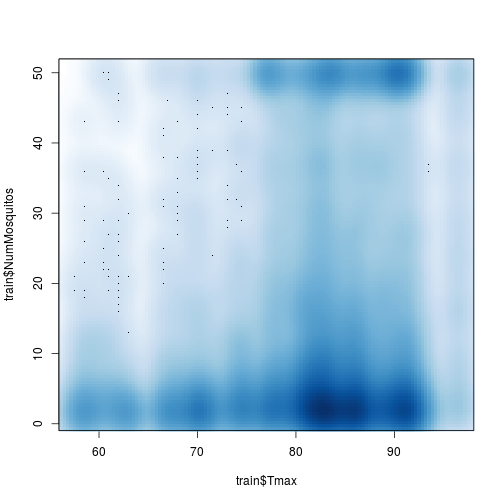

# West Nile Virus Kaggle Competition
The competition is to predict the presence of West Nile Viris in mosquitos
The sampling unit is a trap.
We're given some species information and weather information.

The competition metric is AUC.
## Librarys and options


```r
library(magrittr)
library(dplyr)
library(visreg)
library(e1071)
library(Metrics)
library(randomForest)
library(lubridate)
library(glmnet)

auc <- Metrics::auc

set.seed(101)
```

## Read in data


```r
train <- read.csv('train.csv')
dim(train)
```

```
## [1] 10506    12
```

```r
train %>% head(1) %>% t
```

```
##                        1                                                   
## Date                   "2007-05-29"                                        
## Address                "4100 North Oak Park Avenue, Chicago, IL 60634, USA"
## Species                "CULEX PIPIENS/RESTUANS"                            
## Block                  "41"                                                
## Street                 " N OAK PARK AVE"                                   
## Trap                   "T002"                                              
## AddressNumberAndStreet "4100  N OAK PARK AVE, Chicago, IL"                 
## Latitude               "41.95469"                                          
## Longitude              "-87.800991"                                        
## AddressAccuracy        "9"                                                 
## NumMosquitos           "1"                                                 
## WnvPresent             "0"
```

```r
test <- read.csv('test.csv')


spray <- read.csv('spray.csv')
dim(spray)
```

```
## [1] 14835     4
```

```r
head(spray)
```

```
##         Date       Time  Latitude  Longitude
## 1 2011-08-29 6:56:58 PM 42.391623 -88.089163
## 2 2011-08-29 6:57:08 PM 42.391348 -88.089163
## 3 2011-08-29 6:57:18 PM 42.391022 -88.089157
## 4 2011-08-29 6:57:28 PM 42.390637 -88.089158
## 5 2011-08-29 6:57:38 PM 42.390410 -88.088858
## 6 2011-08-29 6:57:48 PM 42.390395 -88.088315
```

```r
w <- read.csv('weather.csv', stringsAsFactors = FALSE)
dim(w)
```

```
## [1] 2944   22
```

```r
w %>% head(4) %>% t
```

```
##             1            2            3            4           
## Station     "1"          "2"          "1"          "2"         
## Date        "2007-05-01" "2007-05-01" "2007-05-02" "2007-05-02"
## Tmax        "83"         "84"         "59"         "60"        
## Tmin        "50"         "52"         "42"         "43"        
## Tavg        "67"         "68"         "51"         "52"        
## Depart      "14"         "M"          "-3"         "M"         
## DewPoint    "51"         "51"         "42"         "42"        
## WetBulb     "56"         "57"         "47"         "47"        
## Heat        "0"          "0"          "14"         "13"        
## Cool        " 2"         " 3"         " 0"         " 0"        
## Sunrise     "0448"       "-"          "0447"       "-"         
## Sunset      "1849"       "-"          "1850"       "-"         
## CodeSum     " "          " "          "BR"         "BR HZ"     
## Depth       "0"          "M"          "0"          "M"         
## Water1      "M"          "M"          "M"          "M"         
## SnowFall    "0.0"        "M"          "0.0"        "M"         
## PrecipTotal "0.00"       "0.00"       "0.00"       "0.00"      
## StnPressure "29.10"      "29.18"      "29.38"      "29.44"     
## SeaLevel    "29.82"      "29.82"      "30.09"      "30.08"     
## ResultSpeed " 1.7"       " 2.7"       "13.0"       "13.3"      
## ResultDir   "27"         "25"         " 4"         " 2"        
## AvgSpeed    "9.2"        "9.6"        "13.4"       "13.4"
```

Reading through the weather data description I think it needs some sorting out.
But for now I'll ignore the mess.
I want to see how hard it's going to be to merge the weather and training data.

Only two weather stations. The descrimination here will be through time not space.

## Some data exploration
# Submission 1
## Basic models

Let's just try some basic stuff on the data in train.csv (i.e. ignore weather.)
I'll copy a lot of the starter script by mlandry to get it going quickly.

http://www.kaggle.com/users/48625/mlandry/predict-west-nile-virus/h2o-starter/run/2231

As in that script, use 2011 as CV year.


```r
train$dMonth <- substr(train$Date, 6, 7) 
train$dYear <- substr(train$Date, 1, 4) 
test$dMonth <- substr(test$Date, 6, 7)
test$dYear <- substr(test$Date, 1, 4)

train$Species2 <- train$Species
test$Species2 <- test$Species
test$Species2[test$Species2 == 'UNSPECIFIED CULEX'] <- 'CULEX ERRATICUS'
test$Species2 <- factor(test$Species2)

train$SpeciesNArm <- as.character(train$Species2)
test$SpeciesNArm <- as.character(test$Species2)
test$SpeciesNArm[is.na(test$SpeciesNArm)] <- 'CULEX ERRATICUS'
```

```r
fitCv1 <- train %>%
  filter(dYear != 2011) %$%
  glm(WnvPresent ~ dMonth + Species2 + Block, family = "binomial")

par(mfrow = c(2,2))
plot(fitCv1)
```

```
## Warning in sqrt(crit * p * (1 - hh)/hh): NaNs produced
```

```
## Warning in sqrt(crit * p * (1 - hh)/hh): NaNs produced
```

 

```r
par(mfrow = c(2,2))
visreg(fitCv1)

predCv1 <- train %>%
  filter(dYear == 2011) %>%
  predict(fitCv1, newdata = ., type = "response")

## check for a reasonable AUC of the model against unseen data (2011)
train %>%
  filter(dYear == 2011) %>%
  select(WnvPresent) %>%
  table
```

```
## .
##    0    1 
## 1997   57
```

```r
# Kinda stupid but seems I need a integer vector, not a data.frame for auc
train %>%
  filter(dYear == 2011) %>%
  .[['WnvPresent']] %>%
  auc(., predCv1)
```

```
## [1] 0.71173427
```

 

Now add Latitude and longitude


```r
fitCv2 <- train %>%
  filter(dYear != 2011) %$%
  glm(WnvPresent ~ dMonth + Species2 + Block + Latitude + Longitude, family = "binomial")

# Make predictions
predCv2 <- train %>%
  filter(dYear == 2011) %>%
  predict(fitCv2, newdata = ., type = "response")


# Calculate AUC
train %>%
  filter(dYear == 2011) %>%
  .[['WnvPresent']] %>%
  auc(., predCv2)
```

```
## [1] 0.79344016
```

Hooray. An increase. Let's still naively try some different models.
Last one for now. Random Forest.


```r
fitCvRF <- train %>%
  filter(dYear != 2011) %$%
  randomForest::randomForest(WnvPresent ~ dMonth + Species2 + Block + Latitude + Longitude, 
    type = "classification",
    ntree = 2000, 
    mtry = 2)
```

```
## Warning in randomForest.default(m, y, ...): The response has five or fewer
## unique values.  Are you sure you want to do regression?
```

```r
# Make predictions
predCvRF <- train %>%
  filter(dYear == 2011) %>%
  predict(fitCvRF, newdata = ., type = "response")


# Calculate AUC
train %>%
  filter(dYear == 2011) %>%
  .[['WnvPresent']] %>%
  auc(., predCvRF)
```

```
## [1] 0.75138585
```

We'll go with the Random Forest as there's 5 subs a day.


```r
fullRF1 <- train %$%
  randomForest::randomForest(factor(WnvPresent) ~ dMonth + Species2 + Block + Latitude + Longitude, 
    type = "classification",
    ntree = 2000, 
    mtry = 2)


fullRF1.pred <- predict(fullRF1, newdata = test, type = "prob")

subRF1 <- cbind(test$Id, fullRF1.pred[, 2])
colnames(subRF1) <- c("Id","WnvPresent")
options("scipen" = 100, "digits" = 8)

filenameRF1 <- 'subs/rf1sub150425.csv'
write.csv(subRF1, filenameRF1, row.names=FALSE, quote=FALSE)
```

Time to submit!
I did not do well.
# Get some weather data in.


```r
w %>% names
```

```
##  [1] "Station"     "Date"        "Tmax"        "Tmin"        "Tavg"       
##  [6] "Depart"      "DewPoint"    "WetBulb"     "Heat"        "Cool"       
## [11] "Sunrise"     "Sunset"      "CodeSum"     "Depth"       "Water1"     
## [16] "SnowFall"    "PrecipTotal" "StnPressure" "SeaLevel"    "ResultSpeed"
## [21] "ResultDir"   "AvgSpeed"
```

```r
# Change to date format
w$Date %<>% ymd

# Change to numeric.
w$Tavg %<>% as.numeric
```

```
## Warning in function_list[[k]](value): NAs introduced by coercion
```

```r
w$Tmax %<>% as.numeric
w$Tmin %<>% as.numeric

w$Depart %<>% as.numeric
```

```
## Warning in function_list[[k]](value): NAs introduced by coercion
```

```r
w$Heat %<>% as.numeric
```

```
## Warning in function_list[[k]](value): NAs introduced by coercion
```

```r
w$WetBulb %<>% as.numeric
```

```
## Warning in function_list[[k]](value): NAs introduced by coercion
```

```r
# Change to numeric. 1 NA which is actually an NA so that's fine.
w$Cool %<>% as.numeric
```

```
## Warning in function_list[[k]](value): NAs introduced by coercion
```

```r
# 'T' means trace. Which I'm going to count as zero.

w$PrecipTotal %<>% gsub('T', '0', .)
w$PrecipTotal %<>% as.numeric
```

```
## Warning in function_list[[k]](value): NAs introduced by coercion
```

```r
w$SnowFall %<>% gsub('T', '0', .)
w$SnowFall %<>% as.numeric
```

```
## Warning in function_list[[k]](value): NAs introduced by coercion
```

```r
# '-' mean NA. Hopefully that's what as.numeric will do anyway.
w$Sunset %<>% as.numeric
```

```
## Warning in function_list[[k]](value): NAs introduced by coercion
```

```r
w$Sunrise %<>% as.numeric
```

```
## Warning in function_list[[k]](value): NAs introduced by coercion
```

```r
w$SeaLeve %<>% as.numeric
```

```
## Warning in function_list[[k]](value): NAs introduced by coercion
```

```r
w$AvgSpeed %<>% as.numeric
```

```
## Warning in function_list[[k]](value): NAs introduced by coercion
```

```r
w$StnPressure %<>% as.numeric
```

```
## Warning in function_list[[k]](value): NAs introduced by coercion
```

```r
head(w)
```

```
##   Station       Date Tmax Tmin Tavg Depart DewPoint WetBulb Heat Cool
## 1       1 2007-05-01   83   50   67     14       51      56    0    2
## 2       2 2007-05-01   84   52   68     NA       51      57    0    3
## 3       1 2007-05-02   59   42   51     -3       42      47   14    0
## 4       2 2007-05-02   60   43   52     NA       42      47   13    0
## 5       1 2007-05-03   66   46   56      2       40      48    9    0
## 6       2 2007-05-03   67   48   58     NA       40      50    7    0
##   Sunrise Sunset CodeSum Depth Water1 SnowFall PrecipTotal StnPressure
## 1     448   1849             0      M        0           0       29.10
## 2      NA     NA             M      M       NA           0       29.18
## 3     447   1850      BR     0      M        0           0       29.38
## 4      NA     NA   BR HZ     M      M       NA           0       29.44
## 5     446   1851             0      M        0           0       29.39
## 6      NA     NA      HZ     M      M       NA           0       29.46
##   SeaLevel ResultSpeed ResultDir AvgSpeed SeaLeve
## 1    29.82         1.7        27      9.2   29.82
## 2    29.82         2.7        25      9.6   29.82
## 3    30.09        13.0         4     13.4   30.09
## 4    30.08        13.3         2     13.4   30.08
## 5    30.12        11.7         7     11.9   30.12
## 6    30.12        12.9         6     13.2   30.12
```

Ok. That's not too bad.
For now lets see what corelates with mosquito number.
Later I will want to look at data before the date of collection.


```r
# Turn to dates
train$Date %<>% as.character %>% ymd
test$Date %<>% as.character %>% ymd


# Make a reference vector of which rows in w is the same date as the rows in train/test
#   Do once for each station
wTOtr1 <- sapply(train$Date, function(x) which(w$Date == x & w$Station == 1))
wTOtr2 <- sapply(train$Date, function(x) which(w$Date == x & w$Station == 2))

wTOte1 <- sapply(test$Date, function(x) which(w$Date == x & w$Station == 1))
wTOte2 <- sapply(test$Date, function(x) which(w$Date == x & w$Station == 2))

train$PrecipTotal <- cbind(w$PrecipTotal[wTOtr1], w$PrecipTotal[wTOtr2]) %>%
                       apply(., 1, . %>% mean(., na.rm = TRUE))

test$PrecipTotal <- cbind(w$PrecipTotal[wTOte1], w$PrecipTotal[wTOte2]) %>%
                       apply(., 1, . %>% mean(., na.rm = TRUE))


smoothScatter(train$NumMosquitos ~ train$PrecipTotal)
```

 

OK. That kind of surprises me.
I thought there'd be a positive correlation.
The issue with overspilling datapoint when 50 mosquitos is reached is noticeable but not a disaster.


```r
train$Tavg <- cbind(w$Tavg[wTOtr1], w$Tavg[wTOtr2]) %>%
                       apply(., 1, . %>% mean(., na.rm = TRUE))

test$Tavg <- cbind(w$Tavg[wTOte1], w$Tavg[wTOte2]) %>%
                       apply(., 1, . %>% mean(., na.rm = TRUE))


smoothScatter(train$NumMosquitos ~ train$Tavg)
```

 

```r
train$AvgSpeed <- cbind(w$AvgSpeed[wTOtr1], w$AvgSpeed[wTOtr2]) %>%
                       apply(., 1, . %>% mean(., na.rm = TRUE))

test$AvgSpeed <- cbind(w$AvgSpeed[wTOte1], w$AvgSpeed[wTOte2]) %>%
                       apply(., 1, . %>% mean(., na.rm = TRUE))


smoothScatter(train$NumMosquitos ~ train$AvgSpeed)
```

 

```r
train$Tmax <- cbind(w$Tmax[wTOtr1], w$Tmax[wTOtr2]) %>%
                       apply(., 1, . %>% mean(., na.rm = TRUE))

test$Tmax <- cbind(w$Tmax[wTOte1], w$Tmax[wTOte2]) %>%
                       apply(., 1, . %>% mean(., na.rm = TRUE))


smoothScatter(train$NumMosquitos ~ train$Tmax)
```

 

```r
train$StnPressure <- cbind(w$StnPressure[wTOtr1], w$StnPressure[wTOtr2]) %>%
                       apply(., 1, . %>% mean(., na.rm = TRUE))

test$StnPressure <- cbind(w$StnPressure[wTOte1], w$StnPressure[wTOte2]) %>%
                       apply(., 1, . %>% mean(., na.rm = TRUE))


smoothScatter(train$NumMosquitos ~ train$StnPressure)
```

 

Think I need to deal with this 50 mosquito cut off.
However for now let's just fit a RandomForest, and lasso.
I can't be bothered dealing with dummy variables at the moment, so for now I'll skip that.


```r
trainCVMat <- train %>%
  filter(dYear != 2011) %>%
  select(PrecipTotal, Tavg, AvgSpeed, Tmax, StnPressure, Block, Latitude, Longitude, dMonth) %>%
  as.matrix

trainCVMat %<>% apply(., 2, as.numeric)
  


testCVMat <- train %>%
  filter(dYear == 2011) %>%
  select(PrecipTotal, Tavg, AvgSpeed, Tmax, StnPressure, Block, Latitude, Longitude, dMonth) %>%
  as.matrix

testCVMat %<>% apply(., 2, as.numeric)
  

trainFullMat <- train %>%
  select(PrecipTotal, Tavg, AvgSpeed, Tmax, StnPressure, Block, Latitude, Longitude, dMonth) %>%
  as.matrix

trainFullMat %<>% apply(., 2, as.numeric)
  


testFullMat <- test %>%
  select(PrecipTotal, Tavg, AvgSpeed, Tmax, StnPressure, Block, Latitude, Longitude, dMonth) %>%
  as.matrix

testFullMat %<>% apply(., 2, as.numeric)
  

# PrecipTotal has NAs which LASSO doens't like, so remove


fitCvLas <-
  cv.glmnet(x = trainCVMat[, -1], y = train$WnvPresent[train$dYear != 2011], 
    family = 'binomial', alpha = 1)

# Make predictions
predCvLas <- 
  predict(fitCvLas, newx = testCVMat[, -1], type = 'response', s = fitCvLas$lambda.min)


# Calculate AUC
train %>%
  filter(dYear == 2011) %>%
  .[['WnvPresent']] %>%
  Metrics::auc(., predCvLas)
```

```
## [1] 0.74037811
```

```r
fitFullLas <-
  cv.glmnet(x = trainFullMat[, -1], y = train$WnvPresent, 
    family = 'binomial', alpha = 1)

# Make predictions
predFullLas1 <- 
  predict(fitFullLas, newx = testFullMat[, -1], type = 'response', s = fitFullLas$lambda.min)


subLas1 <- cbind(test$Id, predFullLas1)
colnames(subLas1) <- c("Id","WnvPresent")
options("scipen" = 100, "digits" = 8)

filenameLas1 <- 'subs/las1sub150425.csv'
write.csv(subLas1, filenameLas1, row.names=FALSE, quote=FALSE)
```

Time to submit!
Fair bit better. 0.6

Let's do a ridge regression type thing quickly.


```r
fitCvLas.5 <-
  cv.glmnet(x = trainCVMat[, -1], y = train$WnvPresent[train$dYear != 2011], 
    family = 'binomial', alpha = 0.5)

# Make predictions
predCvLas.5 <- 
  predict(fitCvLas.5, newx = testCVMat[, -1], type = 'response', s = fitCvLas.5$lambda.min)


# Calculate AUC
train %>%
  filter(dYear == 2011) %>%
  .[['WnvPresent']] %>%
  Metrics::auc(., predCvLas.5)
```

```
## [1] 0.74036933
```

```r
fitCvLas.1 <-
  cv.glmnet(x = trainCVMat[, -1], y = train$WnvPresent[train$dYear != 2011], 
    family = 'binomial', alpha = 0.1)

# Make predictions
predCvLas.1 <- 
  predict(fitCvLas.1, newx = testCVMat[, -1], type = 'response', s = fitCvLas.1$lambda.min)


# Calculate AUC
train %>%
  filter(dYear == 2011) %>%
  .[['WnvPresent']] %>%
  Metrics::auc(., predCvLas.1)
```

```
## [1] 0.740914
```

```r
fitFullRidge <-
  cv.glmnet(x = trainFullMat[, -1], y = train$WnvPresent, 
    family = 'binomial', alpha = 0.1)

# Make predictions
predFullRidge1 <- 
  predict(fitFullRidge, newx = testFullMat[, -1], type = 'response', s = fitFullRidge$lambda.min)


subRidge1 <- cbind(test$Id, predFullRidge1)
colnames(subRidge1) <- c("Id","WnvPresent")
options("scipen" = 100, "digits" = 8)

filenameRidge1 <- 'subs/ridge1sub150425.csv'
write.csv(subRidge1, filenameRidge1, row.names=FALSE, quote=FALSE)
```

Same as Lasso

Finally. Quickly add interactions?
/* ##################################################### *?


```r
trainCVMat <- train %>%
  filter(dYear != 2011) %>%
  select(Tavg, AvgSpeed, Tmax, StnPressure, Block, Latitude, Longitude, dMonth) %>%
  as.matrix

trainCVMat %<>% apply(., 2, as.numeric)

trainCVMat <- cbind(trainCVMat, trainCVMat[,1] * trainCVMat[,2], trainCVMat[,1] * trainCVMat[,4],
  trainCVMat[,1] * trainCVMat[,6], trainCVMat[,1] * trainCVMat[,8], trainCVMat[,2] * trainCVMat[,4], trainCVMat[,4] * trainCVMat[,8])

  


testCVMat <- train %>%
  filter(dYear == 2011) %>%
  select(Tavg, AvgSpeed, Tmax, StnPressure, Block, Latitude, Longitude, dMonth) %>%
  as.matrix

testCVMat %<>% apply(., 2, as.numeric)

testCVMat <- cbind(testCVMat, testCVMat[,1] * testCVMat[,2], testCVMat[,1] * testCVMat[,4],
  testCVMat[,1] * testCVMat[,6], testCVMat[,1] * testCVMat[,8], testCVMat[,2] * testCVMat[,4], testCVMat[,4] * testCVMat[,8])

  

trainFullMat <- train %>%
  select(Tavg, AvgSpeed, Tmax, StnPressure, Block, Latitude, Longitude, dMonth) %>%
  as.matrix

trainFullMat %<>% apply(., 2, as.numeric)
  

trainFullMat <- cbind(trainFullMat, trainFullMat[,1] * trainFullMat[,2], trainFullMat[,1] * trainFullMat[,4],
  trainFullMat[,1] * trainFullMat[,6], trainFullMat[,1] * trainFullMat[,8], trainFullMat[,2] * trainFullMat[,4], trainFullMat[,4] * trainFullMat[,8])


testFullMat <- test %>%
  select(Tavg, AvgSpeed, Tmax, StnPressure, Block, Latitude, Longitude, dMonth) %>%
  as.matrix

testFullMat %<>% apply(., 2, as.numeric)

testFullMat <- cbind(testFullMat, testFullMat[,1] * testFullMat[,2], testFullMat[,1] * testFullMat[,4],
  testFullMat[,1] * testFullMat[,6], testFullMat[,1] * testFullMat[,8], testFullMat[,2] * testFullMat[,4], testFullMat[,4] * testFullMat[,8])

  

# PrecipTotal has NAs which LASSO doens't like, so remove


fitCvLas2 <-
  cv.glmnet(x = trainCVMat, y = train$WnvPresent[train$dYear != 2011], 
    family = 'binomial', alpha = 1)

# Make predictions
predCvLas2 <- 
  predict(fitCvLas2, newx = testCVMat, type = 'response', s = fitCvLas2$lambda.min)


# Calculate AUC
train %>%
  filter(dYear == 2011) %>%
  .[['WnvPresent']] %>%
  Metrics::auc(., predCvLas2)
```

```
## [1] 0.73727697
```

```r
fitFullLas2 <-
  cv.glmnet(x = trainFullMat, y = train$WnvPresent, 
    family = 'binomial', alpha = 1)

# Make predictions
predFullLas2 <- 
  predict(fitFullLas2, newx = testFullMat, type = 'response', s = fitFullLas$lambda.min)


subLas2 <- cbind(test$Id, predFullLas2)
colnames(subLas2) <- c("Id","WnvPresent")
options("scipen" = 100, "digits" = 8)

filenameLas2 <- 'subs/las2sub150425.csv'
write.csv(subLas2, filenameLas2, row.names=FALSE, quote=FALSE)
```

This gave me my best result so far. But only by a tiny amount.
## References and notes
### Vector competence
http://www.ncbi.nlm.nih.gov/pmc/articles/PMC2631924/

http://jme.oxfordjournals.org/content/38/2/130.abstract
- Tested 2 weeks later for virus.
- Current weather less likely to be important than previous 2-4 weeks?

http://parasitesandvectors.com/content/pdf/1756-3305-3-19.pdf

http://journals.plos.org/plosntds/article?id=10.1371/journal.pntd.0002768
- "90% of the female Culex mosquitoes stayed within 3 km"

Spatial extent of data set ~25km
