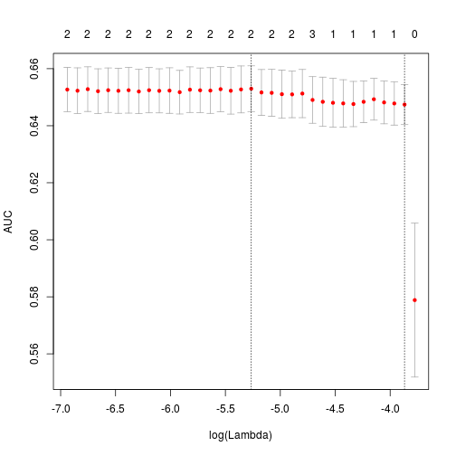
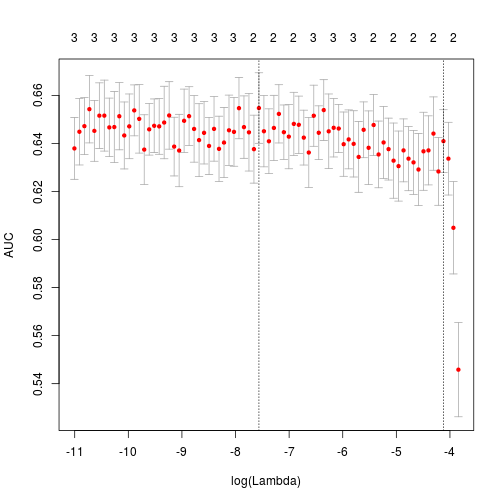

# West Nile Virus Kaggle Data sorting
The competition is to predict the presence of West Nile Viris in mosquitos
The sampling unit is a trap.
We're given some species information and weather information.

The competition metric is AUC.

Here I will sort out the data a bit more properly than my previous analyses.

## Preamble

First some libraries


```r
library(dplyr) # For handling data
library(ggplot2) # For plotting
library(lubridate) # For time data
library(glmnet) # For quick analyses. Lasso/ridge good for seeing which vars are important.
library(doMC)

# Register cores for parallel processesing
registerDoMC(cores = 7)
```

## Read in data
This is all the data given. 

- `train.csv` and `test.csv` contain the basic trap locations etc.

- `spray.csv` contains time and locations of anti mosquito sprays. 
But apparently there is not much data for the test years.

- `weather.csv` contains weather data for each day from 2 weather stations.


```r
train <- read.csv('train.csv', stringsAsFactors = FALSE)
dim(train)
```

```
## [1] 10506    12
```

```r
train %>% head(1) %>% t
```

```
##                        1                                                   
## Date                   "2007-05-29"                                        
## Address                "4100 North Oak Park Avenue, Chicago, IL 60634, USA"
## Species                "CULEX PIPIENS/RESTUANS"                            
## Block                  "41"                                                
## Street                 " N OAK PARK AVE"                                   
## Trap                   "T002"                                              
## AddressNumberAndStreet "4100  N OAK PARK AVE, Chicago, IL"                 
## Latitude               "41.95469"                                          
## Longitude              "-87.800991"                                        
## AddressAccuracy        "9"                                                 
## NumMosquitos           "1"                                                 
## WnvPresent             "0"
```

```r
test <- read.csv('test.csv', stringsAsFactors = FALSE)


spray <- read.csv('spray.csv', stringsAsFactors = FALSE)
dim(spray)
```

```
## [1] 14835     4
```

```r
head(spray)
```

```
##         Date       Time  Latitude  Longitude
## 1 2011-08-29 6:56:58 PM 42.391623 -88.089163
## 2 2011-08-29 6:57:08 PM 42.391348 -88.089163
## 3 2011-08-29 6:57:18 PM 42.391022 -88.089157
## 4 2011-08-29 6:57:28 PM 42.390637 -88.089158
## 5 2011-08-29 6:57:38 PM 42.390410 -88.088858
## 6 2011-08-29 6:57:48 PM 42.390395 -88.088315
```

```r
w <- read.csv('weather.csv', stringsAsFactors = FALSE)
dim(w)
```

```
## [1] 2944   22
```

```r
w %>% head(4) %>% t
```

```
##             1            2            3            4           
## Station     "1"          "2"          "1"          "2"         
## Date        "2007-05-01" "2007-05-01" "2007-05-02" "2007-05-02"
## Tmax        "83"         "84"         "59"         "60"        
## Tmin        "50"         "52"         "42"         "43"        
## Tavg        "67"         "68"         "51"         "52"        
## Depart      "14"         "M"          "-3"         "M"         
## DewPoint    "51"         "51"         "42"         "42"        
## WetBulb     "56"         "57"         "47"         "47"        
## Heat        "0"          "0"          "14"         "13"        
## Cool        " 2"         " 3"         " 0"         " 0"        
## Sunrise     "0448"       "-"          "0447"       "-"         
## Sunset      "1849"       "-"          "1850"       "-"         
## CodeSum     " "          " "          "BR"         "BR HZ"     
## Depth       "0"          "M"          "0"          "M"         
## Water1      "M"          "M"          "M"          "M"         
## SnowFall    "0.0"        "M"          "0.0"        "M"         
## PrecipTotal "0.00"       "0.00"       "0.00"       "0.00"      
## StnPressure "29.10"      "29.18"      "29.38"      "29.44"     
## SeaLevel    "29.82"      "29.82"      "30.09"      "30.08"     
## ResultSpeed " 1.7"       " 2.7"       "13.0"       "13.3"      
## ResultDir   "27"         "25"         " 4"         " 2"        
## AvgSpeed    "9.2"        "9.6"        "13.4"       "13.4"
```

## Road map
- First sort out data into correct formats etc.
- I want to look at the weather data in the days/weeks/months *before* a trap is examined
- Look at species composition and whether the trap has been +ve for WNV in the past
- Look at species composition and WNV in nearby traps.
- The test data for spray is not good. But maybe extract whether there has ever been spray at a trap?

As I'm going to use a matrix of data, I will make a seperate matrix with only numeric data.
And I'll keep the original data.frames in the shape their in at least.
## Data types
There's a lot of annoying leading zeros and things. So let's fix all that.
First training and testing data.
### Y values


```r
yFac.m <- factor(train$WnvPresent)
yNum.m <- train$WnvPresent
```

### Date to POSIX


```r
# Dates to POSIX
train$Date %<>% ymd
test$Date %<>% ymd
spray$Date %<>% ymd
w$Date %<>% ymd

# Also want numeric data of week, month day of the year.
# This will be our final data matrix.

tr.m <- train %$% 
          cbind(day = week(Date) * 7 + day(Date), week = week(Date), month = month(Date))
te.m <- test %$% 
          cbind(day = week(Date) * 7 + day(Date), week = week(Date), month = month(Date))

data.frame(tr.m, WNV = factor(train$WnvPresent, labels = c('Absent', 'Present'))) %>%         
  ggplot(aes(x = WNV, y = day)) + 
    geom_violin(adjust = 1.2)
```

 

```r
g <- cv.glmnet(y = yNum.m, x = tr.m, type.measure="auc", family = 'binomial', parallel = TRUE)
plot(g)
```

 

### Mosquito species to 0/1 dummy variables for each species.
There is unspecified in the test but not in the training.
This doesn't matter in the 0/1 column format.
Also want names that won't cause any column header problems.


```r
# First remove spaces and slashes

train$Species %<>% gsub('\ |/', '-', .)
test$Species %<>% gsub('\ |/', '-', .)

train %>%
  select(Species, WnvPresent) %>%
  group_by(Species) %>%
  summarise(wnv = mean(WnvPresent))
```

```
## Source: local data frame [7 x 2]
## 
##                  Species         wnv
## 1        CULEX-ERRATICUS 0.000000000
## 2          CULEX-PIPIENS 0.088921823
## 3 CULEX-PIPIENS-RESTUANS 0.055134680
## 4         CULEX-RESTUANS 0.017883212
## 5       CULEX-SALINARIUS 0.000000000
## 6         CULEX-TARSALIS 0.000000000
## 7        CULEX-TERRITANS 0.000000000
```

```r
# As Culex erraticus, C. salinarius, C. tarsalis and C. territans all have 0 WNV we can combine them. And this column will get removed.
#   Can also add unspecified as this will then also get removed. Which is good as there's no training info for that class.
train$Species <- train$Species %<>% 
  gsub('CULEX-SALINARIUS|CULEX-TARSALIS|CULEX-TERRITANS', 'CULEX-ERRATICUS', .) %>%
  factor

test$Species <- test$Species %<>% 
  gsub('CULEX-SALINARIUS|CULEX-TARSALIS|CULEX-TERRITANS|UNSPECIFIED-CULEX', 'CULEX-ERRATICUS', .) %>%
  factor

table(train$Species)
```

```
## 
##        CULEX-ERRATICUS          CULEX-PIPIENS CULEX-PIPIENS-RESTUANS 
##                    315                   2699                   4752 
##         CULEX-RESTUANS 
##                   2740
```

```r
table(test$Species)
```

```
## 
##        CULEX-ERRATICUS          CULEX-PIPIENS CULEX-PIPIENS-RESTUANS 
##                  71743                  14521                  15359 
##         CULEX-RESTUANS 
##                  14670
```

```r
# Now make dummy variables and remove intercept

tr.m <- (model.matrix( ~ Species, train))[, -1] %>% 
          cbind(tr.m, .)
te.m <- (model.matrix( ~ Species, test))[, -1] %>% 
          cbind(te.m, .)

g <- cv.glmnet(y = yNum.m, x = (model.matrix( ~ Species, train))[, -1], 
  type.measure="auc", family = 'binomial', , parallel = TRUE)
plot(g)
```

 

### Traps
Not sure if I can do anything with the pure trap data.
Possibly trap as a factor
Otherwise do proportion of WNS Present per trap.


```r
# Are all the test data represented in the training data.
unique(test$Trap) %in% unique(train$Trap)
```

```
##   [1]  TRUE  TRUE  TRUE  TRUE  TRUE  TRUE  TRUE  TRUE  TRUE  TRUE  TRUE
##  [12]  TRUE  TRUE  TRUE  TRUE  TRUE  TRUE  TRUE  TRUE  TRUE  TRUE  TRUE
##  [23]  TRUE  TRUE  TRUE  TRUE  TRUE  TRUE  TRUE  TRUE  TRUE  TRUE  TRUE
##  [34]  TRUE  TRUE  TRUE  TRUE  TRUE  TRUE  TRUE  TRUE  TRUE  TRUE  TRUE
##  [45]  TRUE  TRUE  TRUE  TRUE  TRUE  TRUE  TRUE  TRUE  TRUE  TRUE  TRUE
##  [56]  TRUE  TRUE  TRUE  TRUE  TRUE  TRUE  TRUE  TRUE  TRUE  TRUE  TRUE
##  [67]  TRUE  TRUE  TRUE  TRUE  TRUE  TRUE  TRUE  TRUE  TRUE  TRUE  TRUE
##  [78]  TRUE  TRUE  TRUE  TRUE  TRUE  TRUE  TRUE  TRUE  TRUE  TRUE  TRUE
##  [89]  TRUE  TRUE  TRUE  TRUE  TRUE  TRUE  TRUE  TRUE  TRUE  TRUE  TRUE
## [100]  TRUE  TRUE  TRUE  TRUE  TRUE  TRUE  TRUE  TRUE  TRUE  TRUE  TRUE
## [111]  TRUE  TRUE  TRUE  TRUE  TRUE  TRUE  TRUE  TRUE FALSE FALSE FALSE
## [122] FALSE FALSE FALSE FALSE FALSE FALSE  TRUE  TRUE  TRUE  TRUE  TRUE
## [133]  TRUE  TRUE  TRUE  TRUE  TRUE  TRUE FALSE FALSE  TRUE FALSE  TRUE
## [144]  TRUE  TRUE  TRUE FALSE  TRUE  TRUE
```

```r
# No. They'll have to be NAs


train %>%
  select(Trap, WnvPresent) %>%
  group_by(Trap) %>%
  summarise(wnv = mean(WnvPresent)) %>%
  ggplot(aes(x = factor(Trap), y = wnv)) + 
    geom_bar(stat = 'identity', position = 'dodge')
```

```
## Warning: position_dodge requires constant width: output may be incorrect
```

 

```r
# How often does each trap have WNV?
trapProp <- train %>%
  select(Trap, WnvPresent) %>%
  group_by(Trap) %>%
  summarise(wnv = mean(WnvPresent))

# Add this data to the matrix
tr.m <- trapProp$wnv[sapply(train$Trap, function(x) which(trapProp$Trap == x))] %>%
          cbind(tr.m, trapPrev = .)

# To deal with logical(0) have to write a function
trapNA <- function(x){
  if(length(which(trapProp$Trap == x)) == 0){
    return(NA)
  } else {
    return(which(trapProp$Trap == x))
  }
}

# find indices for test traps and add p(WNV) to matrix.

te.m <- trapProp$wnv[sapply(test$Trap, trapNA  )] %>% 
          cbind(te.m, trapPrev = .)

# See if it is retained with LASSO
g <- glmnet(y = yNum.m, x = tr.m, family = 'binomial', alpha = 1)
plot(g$beta['trapPrev', ] ~ g$lambda, type = 'l')
```

 

```r
# Is pretty strong to start.

# Have a look at how well it does on it's own with glm and plot
data.frame(x = trapProp$wnv[sapply(train$Trap, function(x) which(trapProp$Trap == x))], 
  y = yNum.m) %>%
  glm(y ~ x, data = ., family = 'binomial')
```

```
## 
## Call:  glm(formula = y ~ x, family = "binomial", data = .)
## 
## Coefficients:
## (Intercept)            x  
##     -4.0577      18.6176  
## 
## Degrees of Freedom: 10505 Total (i.e. Null);  10504 Residual
## Null Deviance:	    4321.2 
## Residual Deviance: 4088.9 	AIC: 4092.9
```

```r
data.frame(y = trapProp$wnv[sapply(train$Trap, function(x) which(trapProp$Trap == x))], 
  x = yFac.m) %>%         
  ggplot(aes(x = x, y = y)) + 
    geom_violin(adjust = 1.2)
```

 

### Number of mosquitos found in traps previously
Could have done this and trap prevalence by nearest year as well. But didn't


```r
trapMoz <- train %>%
  select(Trap, NumMosquitos) %>%
  group_by(Trap) %>%
  summarise(numMoz = mean(NumMosquitos))


tr.m <- trapMoz$numMoz[sapply(train$Trap, function(x) which(trapMoz$Trap == x))] %>%
          cbind(tr.m, numMoz = .)


te.m <- trapMoz$numMoz[sapply(test$Trap, trapNA)] %>% 
          cbind(te.m, numMoz = .)


# See if it is retained with LASSO
g <- glmnet(y = yNum.m, x = tr.m, family = 'binomial', alpha = 1)
plot(g$beta['numMoz', ] ~ g$lambda, type = 'l')
```

 

```r
# Gets very much dropped out of the model


data.frame(y = trapMoz$numMoz[sapply(train$Trap, function(x) which(trapMoz$Trap == x))], 
  x = yFac.m) %>%         
  ggplot(aes(x = x, y = y)) + 
    geom_violin(adjust = 1.2)
```

 

